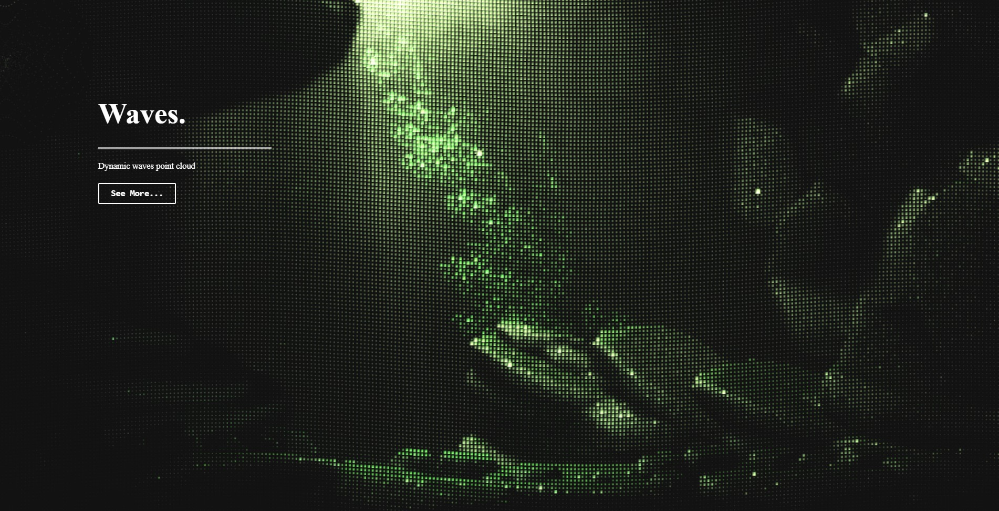

  

<h1 align="center">
  React - Image point clouds
</h1>

 Dynamic and interactive point cloud that shows an image.
 Built with <a href="https://reactjs.org/" target="_blank">ReactJS</a> and hosted on <a href="https://www.netlify.com/" target="_blank">Netlify</a>

